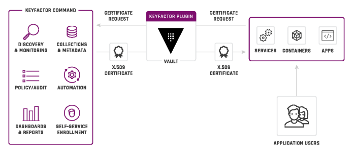
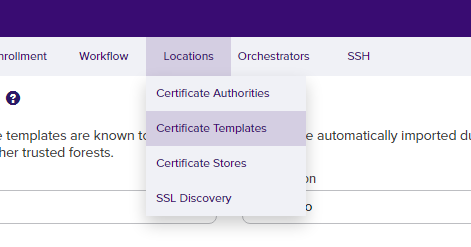
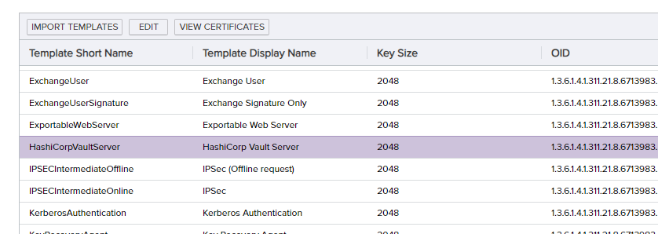
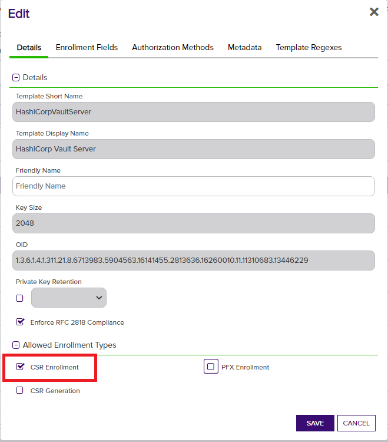
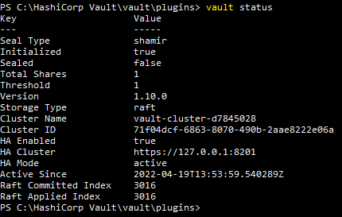
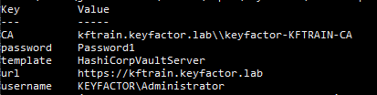
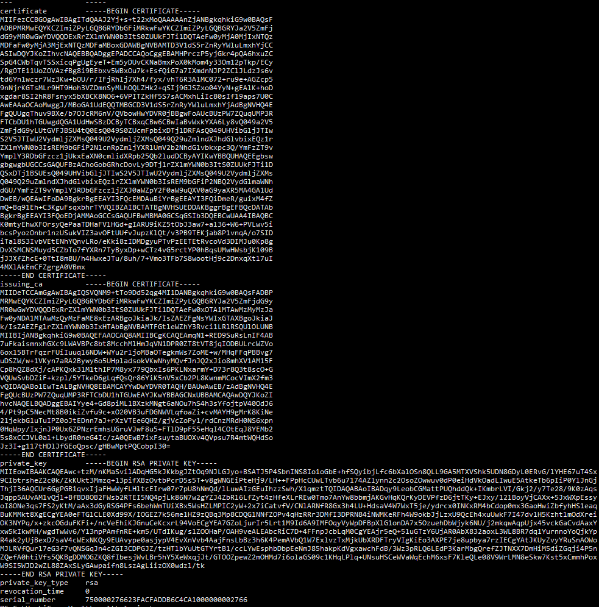

<h1 align="center" style="border-bottom: none">
    Keyfactor Hashicorp Vault Secrets Engine
</h1>

<p align="center">
  <!-- Badges -->

<a href="https://github.com/Keyfactor/hashicorp-vault-secretsengine/releases"></a>


</p>

<p align="center">
  <!-- TOC -->
  <a href="#support">
    <b>Support</b>
  </a> 
  ·
  <a href="#license">
    <b>License</b>
  </a>
  ·
  <a href="https://github.com/topics/keyfactor-integration">
    <b>Related Integrations</b>
  </a>
</p>

## Support
The Keyfactor Hashicorp Vault Secrets Engine is open source and community supported, meaning that there is **no SLA** applicable. 

> To report a problem or suggest a new feature, use the **[Issues](../../issues)** tab. If you want to contribute actual bug fixes or proposed enhancements, use the **[Pull requests](../../pulls)** tab.


# Overview

The Keyfactor Secrets Engine provides a PKI backend for Vault to issue trusted certificates via the Keyfactor platform.
It enables developers to use native Vault API calls and
commands to request certificates from Keyfactor and allows security teams to maintain visibility and control over all
certificates issued to Vault instances.
This plugin connects Vault with trusted public, private, or cloud-hosted CAs configured in the Keyfactor platform.
Certificates are requested through Vault using standard Vault commands, and are then redirected to Keyfactor so that the
certificates can be issued off of a trusted enterprise certificate authority. After issuance, the certificate is then 
returned to Hashicorp Vault and stored within the Vault Secrets store to then be used in other applications.

---

## Table of contents

- [Overview](#overview)
- [Compatibility](#compatibility)
- [Installation Requirements](#installation-requirements)
    - [Keyfactor Requirements](#keyfactor-requirements)
    - [Hashicorp Vault Requirements](#hashicorp-vault-requirements)
- [Installation - Keyfactor](#installation---keyfactor)
    - [Create the Service Account in Command](#create-the-service-account-in-command)
    - [Assign the user permissions in Keyfactor Command](#assign-the-user-permissions-in-keyfactor-command)
    - [Create a certificate template](#create-a-certificate-template)
    - [Allow the template to be used for CSR enrollment](#allow-the-template-to-be-used-for-csr-enrollment-through-keyfactor)
- [Installation - Vault](#installation---vault)
    - [Check the Vault server status](#check-the-vault-server-status)
    - [Install and register the plugin](#install-and-register-the-plugin)
    - [Configure the plugin](#configure-the-plugin)
        - [Basic Authentication](#basic-authentication-configuration)
        - [OpenID Connect / oAuth](#openid-connect--oauth-configuration)
    - [Adding Roles](#adding-roles)
- [Using the plugin](#using-the-plugin)
    - [Issuing Certificates](#issuing-certificates)
    - [Viewing Certificates](#viewing-certificates)
    - [Tidying expired certificates](#tidying-expired-certificates)
- [Command Reference](#plugin-command-reference)
    - [Create/update configuration](#createupdate-configuration)
    - [Read configuration](#read-configuration)
    - [Create/update Roles](#createupdate-role)
    - [List roles](#list-roles)
    - [Read a role](#read-role)
    - [Delete a role](#delete-role)
    - [Request a certificate](#request-certificate)
    - [List certificates](#list-certificates)
    - [View a certificate](#read-certificate)
    - [Revoke a certificate](#revoke-certificate)
    - [Sign a CSR](#sign-csr)
    - [View CA Certificate](#read-ca-cert)
    - [View CA Certificate Chain](#read-ca-chain)
    - [Tidy expired certificates](#tidy-expired-certificates)
    - [Read tidy status](#read-tidy-status)

## Overview

The Keyfactor Secrets Engine for Hashicorp Vault is a Vault plugin that replicates Vault’s onboard PKI API and processes
certificate enrollment requests through the Keyfactor Command or Keyfactor Control platform. In many cases the onboard
PKI engine included with Vault can be swapped for the Keyfactor engine seamlessly, with no impact to Vault client
applications. While the simplicity of the onboard PKI is attractive to developers who are trying to implement the
simplest solution in order to meet encryption requirements, it presents other enterprise teams with some challenges when
it comes to PKI operations and security:

- The Vault infrastructure and root materials are not managed by PKI professionals and policies, but rather by DevOps
  teams that may not be trained in how to properly handle and manage an enterprise PKI.
- Lack of Certificate Lifecycle Management places organizations in a reactionary posture. If there are weaknesses in the
  organization processes, full visibility of the certificates is necessary in order to identify these risks prior to a
  security event or audit failure.
- All certificates are susceptible as an attack surface and should be managed and monitored, regardless of their
  lifetime, to ensure that issuance policies and certificate standards are followed.

Keyfactor Command can provide the control and visibility needed for a Vault environment. Using the Keyfactor Secrets
Engine plugin for Vault, PKI functionality is directed to your enterprise PKI environment, placing control back into the
hands of the enterprise PKI admins, and allowing your PKI admins to stay in control of how and when certificates are
issued. The Keyfactor Secrets Engine offers the following enterprise capabilities:

- Issue certificates and place them into the Vault secrets store using your existing enterprise PKI.
- Eliminate the need for a standalone PKI within the vault environment.
- Gain complete visibility and management of certificates across all Vault instances and manage them through a single
  pane of glass.
- Reporting, alerting, automation, and auditing on the certificates within the environment.
- Easily identify and revoke non-compliant or rogue certificates.
- Integrate with SIEMs and ticketing systems for automated notifications.

  

> [!IMPORTANT]
> The Keyfactor Vault Secrets Engine is designed to be a drop in replacement for the native
> Vault CA, and implements most of the functionality provided by the PKI secrets engine
> to enable enterprise grade certificate management for certificates requested via
> Vault. There are some important security differences when using the Keyfactor plugin,
> namely in how certificate issuance polices are enforced. The plugin only supports domain
> and subdomain restrictive role polices and defers to the Command infrastructure for it's
> issuance security model based on certificate templates. The only role parameters utilized
> by this secrets engine are "AllowedDomains" and "AllowSubDomains". Other parameters
> utilized by the Vault native PKI secrets engine, such as "TTL", "KeyType", "AllowIPSANs",
> etc. For reference, the full list of fields supported by the Vault PKI secrets engine can
> be found [here](https://developer.hashicorp.com/vault/api-docs/secret/pki#list-roles).
> When architecting a solution, consideration should be given to the
> native Vault policies, the roles implemented by the secrets engine plugin, and the template
> rules available in Command.

### Per-instance configuration

The Keyfactor plugin implements a **per-instance configuration**. Because Vault mounts every enabled
secrets engine at its own path, you can register and enable multiple independent instances of this
plugin at the same time, each with its own configuration, certificate store, roles, and default CA and
template. Each instance is scoped to a single Keyfactor Command connection and a single service-account
identity.

This is a deliberate architectural choice rather than an incidental behavior. It lets you dedicate a
separate plugin instance to each certificate issuance workflow — for example, one instance
authenticating as a service account restricted to web-server templates, and a second instance scoped to
a different CA, template, and identity for client-authentication certificates. Because Vault ACL
policies are applied per mount path, this also allows you to grant different Vault clients access to
different Command identities and issuance policies without them interfering with one another.

The remainder of this document describes configuring a single instance; repeat the enable and configure
steps for each additional instance you require, giving each a distinct mount path.

## Compatibility

This Vault Plugin has been tested against Hashicorp Vault version 1.10+ and the Keyfactor Platform 9.6+. We provide
several pre-built binary files that correspond to various operating systems and processor architectures. If not building
the plugin from source code, select the os/architecture combination that corresponds to your environment.

## Installation Requirements

The requirements for the plugin are relatively simple. It runs as a single executable on the Hashicorp Vault server.
There are no specific system requirements to install it, however there are a few general things that must be in place
for
it to function properly. These requirements are listed below, and are then expanded in the details throughout this
document.

### Keyfactor Requirements

- A functional instance of Keyfactor Command
- An administrative user account to be used for configuring the Keyfactor options needed for the implementation
- A functional integrated certificate authority to be used for issuing the certificates
- A certificate template (or templates) defined to use for certificate issuance.
- A user account with permissions to connect to the Keyfactor API and submit certificate requests. This user account
  will require READ and ENROLL permissions on the certificate template that you will use for the Vault plugin.

### Hashicorp Vault Requirements

- A functional Hashicorp Vault Installation **version 1.10.xx or greater**.
- An administrative account with permission to login to the Hashicorp Vault server in order to make administrative
  changes.
- An adequate number of unseal keys to meet the minimum criteria to unseal the Hashicorp Vault
- A Hashicorp Vault login token

## Installation - Keyfactor

### Create the Service Account in Command

This plugin authenticates to the Keyfactor Command API using one of two methods:

- **Basic** — an Active Directory username, password, and domain.
- **OAuth / OpenID Connect** — a client ID, client secret, and token endpoint (or a pre-obtained access token).

For the purposes of this document, we will not go into the details of how to create each type of service entity.
Refer to the Keyfactor platform documentation for guidance on creating these service accounts.

The configuration of the plugin will differ slightly for each approach. Here is a table with the values
needed for authentication for each approach:

| Basic | oAuth |
| ----- | ----- |
| Username (`username`) | Client ID (`client_id`) |
| Password (`password`) | Client Secret (`client_secret`) |
| AD Domain (`domain`) | Token Endpoint (`token_url`) |

These values are discussed in greater detail in the [Configure the plugin](#configure-the-plugin) section of this document.

> [!NOTE]
> `command_cert_path` and `skip_verify` control how the plugin *trusts Command's server TLS certificate*;
> they are not authentication credentials. See [Configure the plugin](#configure-the-plugin).

### Assign the user permissions in Keyfactor Command

In order to be able to enroll for certificates through the Keyfactor Command API, it will be necessary to create the
necessary role and delegate permissions within Keyfactor. It is not a requirement that this be a new role. If there is
an existing role within your organization that allows for these basic permissions, that role can be used for this
connection. If you do not have an existing role, and would like to create one, those steps are described later in this
document.

### Create a certificate template

The first step to configuring Keyfactor is to create the certificate template that will be used for the enrollment and
publish it into Keyfactor.  This template can be created in Active Directory for AD based Certificate Authorities, or created as 
Certificate Profiles in EJBCA and imported into Command.

Refer to the Keyfactor Command documentation for instructions on how to create a Certificate Template in Command.

### Allow the template to be used for CSR enrollment through Keyfactor

Once the template has been imported into Keyfactor Command, it is then necessary to enable that template for CSR
enrollment through the console.

To enable CSR enrollment on the template:

1. Select Locations from the top menu bar, then select "Certificate Templates"
   

1. Look through the list to locate the certificate template that was created and previously imported into the Keyfactor
   console. Double Click on that template.
   

1. On the properties tab for the template, enable CSR enrollment. Then click Save
   

## Installation - Vault

This document covers configuration of the Keyfactor Secrets Engine Plugin for Hashicorp Vault, and assumes that there is
a running Vault environment in place. This document does not cover the steps necessary to do the initial install and
configuration of Hashicorp Vault.

On the server that will host the vault plugin, it will be necessary to setup the appropriate environment variables and
configuration files to enable the plugin to run and establish a connection back to Keyfactor Command. The specific
syntax for setting environment variables will differ slightly between Windows and Linux distributions, but the approach
is the same.

### Check the Vault server status

Hashicorp Vault must be installed and running to install and register the Keyfactor Secrets Plugin. To check the status
of the Vault installation on the server being used, log into the Vault server with a logon account that has sufficient
administrative privileges, and issue the following command:

`vault status`

The results returned should look something like this:



There are 2 key values to look for in these results:

1. **Initialized** – Verify that the vault has been initialized and the status shows TRUE. If this value is FALSE, it
   means that this is a new instance of Vault that has not yet been initialed. You will need to go through a Vault
   initialization using the "vault operator init" command prior to proceeding.

1. **Unsealed** – In order to perform operations against a vault instance, the vault must be unsealed with the unlock
   keys that were generated during the initialization process. Vault has a (m of n) key requirement… so for instance 3
   of the 5 keys must be entered to unseal the vault. (This requirement can vary based on configuration) If the current
   status of the vault shows SEALED then it is necessary to enter these keys to unseal the vault. These keys can be
   entered individually (and potentially by different people or processes)

```

# vault operator unseal 3TGWPmQDdqkRsV9VamEYJ0tolsaEEo3u4kuwy2o6u6Om

# vault operator unseal Ja4AGQ4N8193/5O7hJPpRcncmqBpnH1mdjqcQSqDVq6v

# vault operator unseal cuE1X01NrNgeAU6ao5aNUFsjWAPhOgEPkgaW5Vl19XDg
```

or they can be all issued within a single command as illustrated below:

```

# vault operator unseal 3TGWPmQDdqkRsV9VamEYJ0tolsaEEo3u4kuwy2o6u6Om && vault operator unseal
Ja4AGQ4N8193/5O7hJPpRcncmqBpnH1mdjqcQSqDVq6v && vault operator unseal
cuE1X01NrNgeAU6ao5aNUFsjWAPhOgEPkgaW5Vl19XDg
```

Once the appropriate number of keys has been entered, the status should indicate "Unsealed = True"

### Install and register the plugin

To install and register the plugin on the Vault server, follow these steps:

1. Copy the Keyfactor plugin binary into a directory on the Vault server using SFTP or another file copy process. The
   location of this file does not really matter, but typically would be in a Vault plugins directory.

   An example plugins path may look like this:

   `/usr/bin/vault/plugins`

1. Set the file to be executable.

   `chmod +x keyfactor`

1. The sha256 checksum should have been provided in the release zip file.  
   If you are building the plugin from scratch, you can run the following command to get this value:

   `sha256sum ./keyfactor`

   The result will show the sha256 value that will be needed in the next step.

1. Registering the new secrets engine within Vault is done using a vault plugin command to register the plugin into the
   Vault secrets catalog.

   Linux:

   `# vault plugin register -sha256=47f549d44ab2abcb528aa45725b3a83334a9465bb487f3d1182add55e5580c36 secret <instance name>`

   Windows:

   `> vault plugin register -sha256=97a76ee45f8bbc3e852520cba38d16206f6a92ab0b8a2d2bbd7eaaae064ae9bf -command="keyfactor.exe" secret <instance name>`

   > Windows requires the binary to have a recognized executable extension, so we name the windows executable
   keyfactor.exe.

   The result should look like this: `Success! Registered plugin: <instance name>`

   > _For the rest of this document, we will assume that the instance of the plugin is named "keyfactor"._

1. Enable the plugin within Hashicorp Vault
   Once the plugin is installed into Vault, it just needs to be enabled. As a part of this enable process, you must
   specify the endpoint name that will be used for the secrets engine. This name is arbitrary. For this example, we are
   using keyfactor as the enpoint name, but it can be named to match existing endpoints that you are looking to replace
   with a connection to Keyfactor if necessary.

   run the following command:

   `vault secrets enable keyfactor`

   if successful the output should look like this:

   `Success! Enabled the keyfactor secrets engine at: keyfactor/`

1. Check the registered paths for the plugin
   The Hashicorp vault plugin architecture generates endpoints for each plugin. Run the vault `path-help` command to
   view the registered paths.

   `vault path-help keyfactor`

   the output should look similar to the following:

```

## DESCRIPTION

The Keyfactor backend is a pki service that issues and manages certificates.

## PATHS

The following paths are supported by this backend. To view help for
any of the paths below, use the help command with any route matching
the path pattern. Note that depending on the policy of your auth token,
you may or may not be able to access certain paths.

    ^ca
        Fetch a CA, CRL, CA Chain, or non-revoked certificate.
        pass "ca=<ca name>" to retrieve them for a CA other than the one set in the configuration.

    ^ca_chain
        Fetch a CA, CRL, CA Chain, or non-revoked certificate.
        pass "ca=<ca name>" to retrieve them for a CA other than the one set in the configuration.

    ^certs/?$
        Use with the "list" command to display the list of certificate serial numbers for certificates managed by this secrets engine.

    ^certs/(?P<serial>[0-9A-Fa-f-:]+)$
        Fetch a CA, CRL, CA Chain, or non-revoked certificate.

    ^config$
        Configure the Keyfactor Secrets Engine backend.

    ^issue/(?P<role>\w(([\w-.]+)?\w)?)$
        Request a certificate using a certain role with the provided details.
        example: vault write keyfactor/issue/<role> common_name=<cn> dns_sans=<dns sans>

    ^revoke/(?P<serial>[0-9A-Fa-f-:]+)$
        Revoke a certificate by serial number.

    ^roles/?$
        List the existing roles in this backend

    ^roles/(?P<name>\w(([\w-.]+)?\w)?)$
        Manage the roles that can be created with this backend.

    ^sign/(?P<role>\w(([\w-.]+)?\w)?)$
        Request certificates using a certain role with the provided details.
        example: vault write keyfactor/sign/<role> csr=<csr>

    ^tidy$
        Tidy up the locally-stored certificate store by removing expired certificates.

    ^tidy/status$
        Return the status of the most recent tidy operation.

```

If you see this, you have successfully installed the plugin.  Now we can configure it for connecting with Command for certificate enrollment.

### Configure the plugin

Once the plugin has been successfully installed, the next step is to set the configuration values that will allow it to
interact with the Keyfactor platform.

The Keyfactor plugin uses a per-instance configuration (see
[Per-instance configuration](#per-instance-configuration) in the Overview). The settings described below
apply to the single plugin instance you are configuring; repeat these steps for each additional instance.

To set a configuration value:

`vault write <instance name>/config <key>="<value>"`

Here is a table of the available configuration paramaters
| name | value type | required | default | description |
| ---- | ---------- | -------- | ------- | ----------- |
| **url**  | string     | yes      | | The url pointing to the keyfactor platform with no trailing slashes **(example: "https://kftrain.keyfactor.lab")** |
| **api_path** | string | no       | _"KeyfactorAPI"_ | The path after the Command instance url to reach the Keyfactor API |
| **ca**    | string | no[^1]      | |  | The certificate authority used when issuing certificates via the plugin **(example: kftrain.keyfactor.lab\\\\keyfactor-KFTRAIN-CA)** |
| **template** | string | no[^1]   | | The certificate template name to use when issuing certificates. It should be issuable by the CA |
| **username** | string | no[^2]   | | basic authentication: username |
| **domain** | string | no[^2]     | | basic authentication: Active Directory Domain |
| **password** | string | no[^2]   | | basic authentication: password |
| **client_id** | string | no[^3]  | | oAuth authentication: client ID |
| **client_secret** | string | no[^3] | |oAuth authentication: Client Secret |
| **token_url** | string | no[^3]  | | oAuth authentication: Endpoint for retreiving the authentication token |
| **access_token** | string | no   | | oAuth access token, if retrieved outside the context of the plugin |
| **scopes** | []string (comma separated list) | no | | the defined scopes to apply to the retreived token in the oAuth authorization flow.  If not provided, all available scopes for the service account will be assigned to the token upon authentication |
| **audience** | string | no | | the OpenID Connect v1.0 or oAuth v2.0 token audience |
| **skip_verify** | bool | no | _false_ | set this to true to skip verification of the Command **server's** TLS certificate. Intended for test environments only; leave false in production |
| **command_cert_path** | string | no | | the local path to a PEM-encoded CA certificate used to **trust the Command server's TLS certificate**, when it is not already trusted by the host and skip_verify is false. This establishes server trust only; it is not a client authentication credential |
| **tidy_enabled** | bool | no | _false_ | when true, the plugin periodically removes locally-stored certificates that have expired. See [Tidying expired certificates](#tidying-expired-certificates) |
| **tidy_interval** | duration | no | _24h_ | how often the automatic tidy sweep runs when tidy_enabled is true |
| **tidy_safety_buffer** | duration | no | _72h_ | how long an expired certificate is retained past its expiry before the tidy sweep removes it |

[^1]: The **ca** and **template** fields can be provided via command line parameters.  If they are not provided, the plugin will default to what is set in the configuration values.  If neither are available an error will occur.

#### Basic Authentication Configuration

If you are using basic authentication to Keyfactor Command, you will also need to set the following values:

- **domain**
    - The Active Directory domain of the account **(example: "KEYFACTOR")**
- **username**
    - The username of the account used for authenticating to the platform excluding the domain **(example: "VaultUser")**
- **password**
    - The password corresponding to the user account for authenticating to the platform.

[^2]: While none of these configuration values are explicitly required; they are _all_ required in order to use basic (username/password) authentication into Command.

#### OpenID Connect / oAuth Configuration

If you are using an oAuth or OpenID Connect provider to authenticate into Keyfactor Command, you will also need to set the following values:
- **client_id**
    - The client ID of the service principal account used to authenticate

- **client_secret**
    - The client secret value generated via the identity provider when the service account was created 

- **token_url**
    - The url where the token can be requested

[^3]: While none of these configuration values are explicitly required; they are _all_ required in order to use openID Connect / oAuth authentication into Command.

##### Access Token

Rather than have the plugin perform the oAuth/OpenID authentication workflow, it is also possible to retreive the access token yourself and provide it in the configuration.
If a valid access token is provided then the values for **client_id**, **client_secret** or **token_url** are not required.

Once you've set the configuration properties, run the command:
`vault read <instance name>/config`
in order to view the configuration settings (see example below).



> [!NOTE]
> By default the sensitive values (password, client_secret) are hidden.  To show these, pass the "show_hidden=true" parameter to the request; `vault read <instance name>/config show_hidden=true`

### Adding Roles

Hashicorp Vault supports being able to add roles to control certificate issuance policies for allowed domains and
allowing sub-domain certificates to be created.
To create a role, use the vault write command as in the below example.

`vault write keyfactor/roles/hashiwebserver allowed_domains=kftrain.lab allow_subdomains=true`

This will create a role called "hashiwebserver" that can be used to generate certificates for domains ending with "
kftrain.lab".

> [!NOTE]
> Use "*" for the value in "allowed_domains" to allow issuing for any domain.

These properties can also be set in the certificate template configured in Command. If they differ, the most restrictive setting is applied.

## Using the plugin

### Issuing Certificates

When requesting a certificate using the Keyfactor plugin, the command is the same as if you were issuing the certificate
through the vault integrated PKI. As a part of the write command you will specify the role name you would like to use,
as well as the common name on the certificate. A typical certificate issuance command is listed below for the
hashiwebserver role, and a CN of foo.kftrain.lab on the certificate.

`vault write keyfactor/issue/hashiwebserver common_name=foo.kftrain.lab dns_sans=foo.kftrain.lab`

The resulting response will show the certificate data response for the request. This certificate will also be stored in
the Vault secrets store.



> [!NOTE]
> The Certificate Authority and Template values can be passed via command parameters.  If they are omitted, the values set in the configuration are used.

> [!NOTE]
> As of v1.4, certificate Metadata is able to be provided in the command line and submitted along with the signing request.
> example: `vault write keyfactor/issue/hashiIssuer common_name="test.com" dns_sans="test.com" metadata='{ \"testMetadata\": \"arbitrary string value\" }' ca="myCA"`
> **Make sure that the quotation marks as escaped, as above, or an error will be returned.**

### Viewing Certificates

After certificates are stored in the secrets store, you can then retrieve those certificates at a later time if
necessary. To list the certificates that exist within the Vault store, use the LIST option with vault. The only
parameter that you need to include is the secrets store name for the store that you would like to read. The system will
then return the serial numbers of the certificates present in that secrets store.

`vault list keyfactor/certs`

To also see the common name of each certificate, add the `-detailed` flag (the common name is returned as
additional key information that the standard `vault list` output does not display):

`vault list -detailed keyfactor/certs`

The plain command returns a list of serial numbers for the certificates in that store location:

```
Keys
----
750000276546d818cbe70231b6000000002765
750000276623facfaddb6c4ca1000000002766
```

If you would like to retrieve a specific certificate from the store, you can do so by using the "vault read" command,
and specifying the serial number of the certificate that you would like returned. The format for the command looks like
this:

`vault read keyfactor/cert/<serial>`

example:

`vault read keyfactor/cert/750000276546d818cbe70231b6000000002765`

The response includes the certificate's serial number, common name, the PEM-encoded certificate content, the
expiration date, and the revocation time (`0` if the certificate has not been revoked). If metadata was submitted
when the certificate was issued, it is also included; the metadata field is omitted when none was provided. For
example:

```
Key                Value
---                -----
certificate        -----BEGIN CERTIFICATE-----
LS0tLS1CRUdJTiBDRVJUSUZJQ0FURS0tLS0tDQpNSUlGZXpDQ0JHT2dBd0lCQWdJ
VGRRQUFKMlZHMkJqTDV3SXh0Z0FBQUFBblpUQU5CZ2txaGtpRzl3MEJBUXNGDQpB
REJQTVJNd0VRWUtDWkltaVpQeUxHUUJHUllEYkdGaU1Sa3dGd1lLQ1pJbWlaUHlM
R1FCR1JZSmEyVjVabUZqDQpkRzl5TVIwd0d3WURWUVFERXhSclpYbG1ZV04wYjNJ
dFMwWlVVa0ZKVGkxRFFUQWVGdzB5TWpBME1qSXhOVE0xDQpNVGxhRncweU1qQTNN
akV4TlRNMU1UbGFNQm94R0RBV0JnTlZCQU1URDNWMWRTNXJablJ5WVdsdUxteGhZ
akNDDQpBU0l3RFFZSktvWklodmNOQVFFQkJRQURnZ0VQQURDQ0FRb0NnZ0VCQU9h
MmEwQzVoeWpvUHRWbWNqUGRVZlhuDQpKU3BvbkRyQ1dJT1ROcmxTcytkbWM3aFNw
SjdTanZvcCtSZUIrRFVQWWhXbFBETWZlOGFFSEkyUFAwMGg3dVd3DQpBaHJ6T2Jk
MmthUkhyOXZDU2h6dE1vYjBQd0JrTG9MK2JLUWRIK2xTM1RVMHpKQytidUV0WWJ3
dHcvOGJSdFNFDQpIRWJaMXNrU1Y5RmJzWlBjb3I2WTVqcFV0ck85Y1dhbUs3d0Jw
dkFnVHEzYk44ZWt5ZUl4R1V6YVhjRHd2aEVnDQoxcG5xS1loY3NmOU03b2R1Ullv
Uytpcy9BTmlXZllSMDZBV29odE41VHlJVXBlcnVIZEh6WWpBYXJ4RXhzWEFrDQpR
d3BxVGF5dTFNUWU1cllYdWpyL1FEOG5EbGl5TXp6NjJINmNjRkRmWmhHNWZkVUJK
K25uRTlTbllabDRCcmNDDQpBd0VBQWFPQ0FvTXdnZ0ovTUJvR0ExVWRFUVFUTUJH
Q0QzVjFkUzVyWm5SeVlXbHVMbXhoWWpBZEJnTlZIUTRFDQpGZ1FVS0E0VkFhS3M5
a2RjL3VXQXR3Sm5TSUJleVM4d0h3WURWUjBqQkJnd0ZvQVVjQlV6UFc3WlF1cVVN
UDNSDQpGVENiRFUxaFRHVXdnZFFHQTFVZEh3U0J6RENCeVRDQnhxQ0J3NkNCd0lh
QnZXeGtZWEE2THk4dlEwNDlhMlY1DQpabUZqZEc5eUxVdEdWRkpCU1U0dFEwRXNR
MDQ5UzBaVWNtRnBiaXhEVGoxRFJGQXNRMDQ5VUhWaWJHbGpKVEl3DQpTMlY1SlRJ
d1UyVnlkbWxqWlhNc1EwNDlVMlZ5ZG1salpYTXNRMDQ5UTI5dVptbG5kWEpoZEds
dmJpeEVRejFyDQpaWGxtWVdOMGIzSXNSRU05YkdGaVAyTmxjblJwWm1sallYUmxV
bVYyYjJOaGRHbHZia3hwYzNRL1ltRnpaVDl2DQpZbXBsWTNSRGJHRnpjejFqVWt4
RWFYTjBjbWxpZFhScGIyNVFiMmx1ZERDQnlBWUlLd1lCQlFVSEFRRUVnYnN3DQpn
Ymd3Z2JVR0NDc0dBUVVGQnpBQ2hvR29iR1JoY0Rvdkx5OURUajFyWlhsbVlXTjBi
M0l0UzBaVVVrRkpUaTFEDQpRU3hEVGoxQlNVRXNRMDQ5VUhWaWJHbGpKVEl3UzJW
NUpUSXdVMlZ5ZG1salpYTXNRMDQ5VTJWeWRtbGpaWE1zDQpRMDQ5UTI5dVptbG5k
WEpoZEdsdmJpeEVRejFyWlhsbVlXTjBiM0lzUkVNOWJHRmlQMk5CUTJWeWRHbG1h
V05oDQpkR1UvWW1GelpUOXZZbXBsWTNSRGJHRnpjejFqWlhKMGFXWnBZMkYwYVc5
dVFYVjBhRzl5YVhSNU1BNEdBMVVkDQpEd0VCL3dRRUF3SUZvREE5QmdrckJnRUVB
WUkzRlFjRU1EQXVCaVlyQmdFRUFZSTNGUWlEbWVSL2d1aXhNNGZaDQptUStCcTkx
RWgrQzNLZ3VGc3F4YmhyVFlWUUlCWkFJQkNUQVRCZ05WSFNVRUREQUtCZ2dyQmdF
RkJRY0RBVEFiDQpCZ2tyQmdFRUFZSTNGUW9FRGpBTU1Bb0dDQ3NHQVFVRkJ3TUJN
QTBHQ1NxR1NJYjNEUUVCQ3dVQUE0SUJBUUNBDQpqa1ZBTi9hL0NtVm5DTVV2RW1V
S0FuN1BhMFlpTmxxZVJwU2NIZ1dpYnZjc0NLM1Z1VTlSaENBdldpb1RBMytwDQpr
VXhYL0c4LzFlOXRlcWJnaElMZ2ZtemJuWndvZU1BTHo0aFZqYmtVYy83cGpaSVBr
ejA1cXRaT1ZSUzluaEVMDQpRM0xocEFtcmZXbzYxU0l3bHl3WEowV1YxU050UEtu
bUFvQUV2ZUIvSEpNSitkeTM1Q084Y2tOMFVidmk2OUhsDQoya1pIdE1LUWJsckk3
ZXV2MHdnVERqWVIvdms3Yjl0UWlxSmE0YURvMnRsZmF2KzF4Tk40WVdxa3R2QUth
c3hsDQpBVW02bjdydVh5OEs4d005bEFVU2Rwb29iNzdQQ1lpTWhZRkF0ODUzQVlD
R1N0bU1nT21Pa0F1YVVEUHNET3pQDQplUXd1S25Hdy82WDJlUXltaU1BWQ0KLS0t
LS1FTkQgQ0VSVElGSUNBVEUtLS0tLQ0K
-----END CERTIFICATE-----
revocation_time    0
```

### Tidying expired certificates

Unless a role is configured with `no_store=true`, the plugin keeps a copy of every issued certificate in its
Vault storage (along with the certificate's Keyfactor ID and any revocation record). Over time, expired
certificates accumulate and consume storage. The `tidy` operation reclaims that space by removing certificates
whose expiration date (`NotAfter`), plus a safety buffer, has passed. The associated Keyfactor ID and revocation
records are removed along with each certificate.

To run a tidy sweep on demand:

`vault write keyfactor/tidy safety_buffer=72h`

The sweep runs in the background so it does not block the request. To view its progress and the results of the
most recent run:

`vault read keyfactor/tidy/status`

The status includes whether a sweep is currently running, when it last ran, and how many certificates were
examined, deleted, and skipped.

You can also enable automatic, scheduled tidying through the configuration:

`vault write keyfactor/config tidy_enabled=true tidy_interval=24h tidy_safety_buffer=72h`

When enabled, the plugin runs the sweep automatically on the configured interval (on the active node of the
primary cluster). Automatic tidy is **disabled by default**, so no certificates are ever removed until you either
run `keyfactor/tidy` manually or set `tidy_enabled=true`.

> [!NOTE]
> Certificates that cannot be parsed are skipped and never deleted. Certificates issued using a role with
> `no_store=true` are not stored in the first place, so they are unaffected by tidy.

## Plugin command reference

The following commands are supported by the Keyfactor Hashicorp Vault Secrets Engine plugin. These examples assume the
instance of the plugin is named "keyfactor".

### Create/update configuration

`vault write keyfactor/config <key>=<value>`

### Read configuration

`vault read keyfactor/config`

### Create/update role

`vault write keyfactor/roles/<rolename> allowed_domains="<domain1>,<domain2>" allow_subdomains=true`

### List roles

`vault list keyfactor/roles`

### Read role

`vault read keyfactor/roles/<rolename>`

### Delete role

`vault delete keyfactor/roles/<rolename>`

### Request certificate

`vault write keyfactor/issue/<rolename> common_name=<CN> dns_sans=<DNS_SANS>`

### List certificates

`vault list keyfactor/certs`

### Read certificate

`vault read keyfactor/certs/<serial number>`

> Note: Certificate serial numbers are provided in the output for enrollment and list commands

### Revoke certificate

`vault write keyfactor/revoke serial=<serial>`

### Sign CSR

`vault write keyfactor/sign/<role name> csr=<csr>`

### Read CA cert

`vault read keyfactor/ca ca=<ca name>`
> Note: The certificate for the CA needs to have been imported into Command for this endpoint to return the CA Certificate

### Read CA chain

`vault read keyfactor/ca_chain ca=<ca name>`
> Note: _All_ certificates in the chain need to have been imported into Command for this endpoint to return the CA Certificate Chain

### Tidy expired certificates

`vault write keyfactor/tidy safety_buffer=<duration>`
> Note: `safety_buffer` is optional and defaults to 72h. The sweep runs in the background.

### Read tidy status

`vault read keyfactor/tidy/status`


## License

Apache License 2.0, see [LICENSE](LICENSE).

## Related Integrations

See all [Keyfactor integrations](https://github.com/topics/keyfactor-integration).